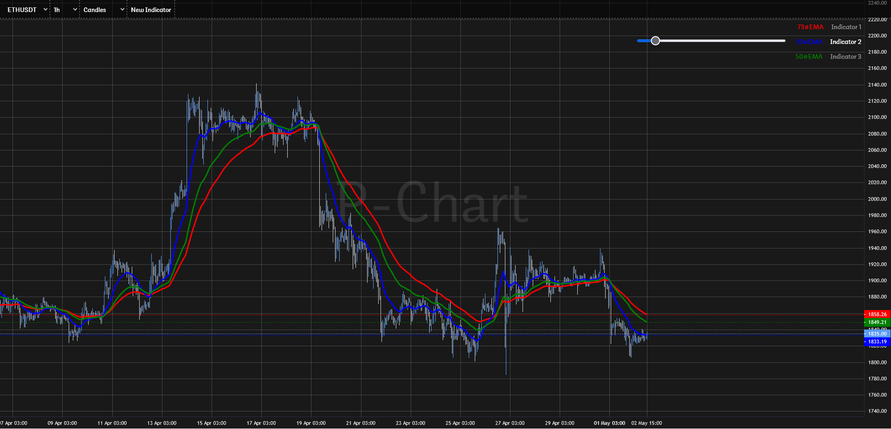
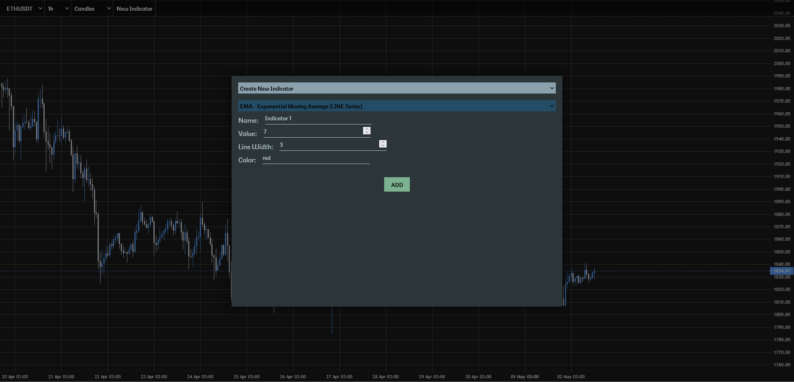

# P-Chart

P-chart is a compact and user-friendly charting library, offering an interactive experience for analyzing market data.
It's designed for simplicity and customization, providing essential features to support informed trading decisions.

## Features

- Switching between markets
- Adjustable timeframe candles
- Candlestick and Heikin Ashi charts
- Integration of various indicators

Node Version: 18.15.0
NPM Version: 9.5.0